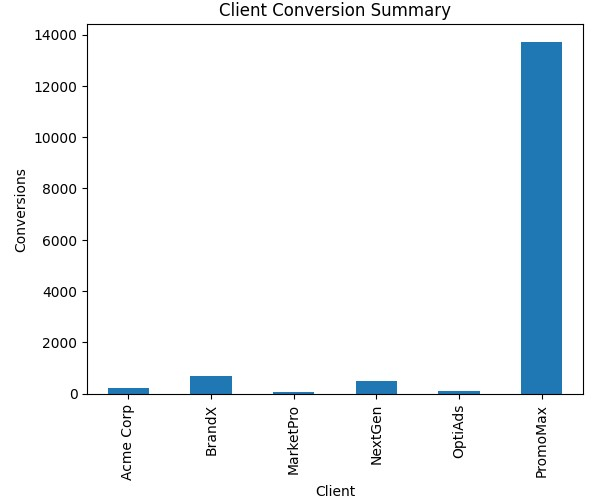
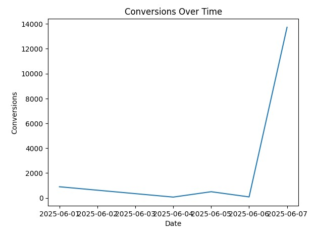
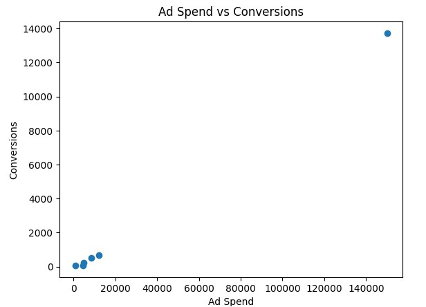
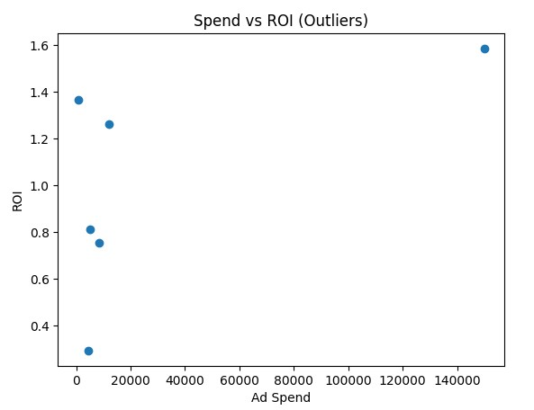

# 📊 Marketing Campaign Data Analysis & Visualization

This project analyzes marketing campaign data using **Python, Pandas, NumPy, and Matplotlib**.  
It includes data cleaning, simulated campaign metrics, and multiple visualizations to evaluate marketing performance.

---

## 🚀 Project Overview

The goal of this project is to:

- Clean and standardize raw campaign data
- Simulate realistic marketing performance metrics
- Analyze relationships between ad spend, conversions, and ROI
- Identify performance trends and potential outliers
- Generate actionable visual insights

---

## 🛠️ Technologies Used

- Python
- Pandas
- NumPy
- Matplotlib

---

## 📂 Data Processing Steps

### 1️⃣ Data Cleaning

- Standardized column names
- Converted dates to proper datetime format
- Converted ad spend to numeric values
- Removed duplicates
- Filled missing ad spend values with median
- Dropped invalid dates

### 2️⃣ Simulated Marketing Metrics

Since the raw dataset lacked performance metrics, the following were simulated:

- **Impressions** (based on ad spend)
- **Clicks** (CTR-based simulation)
- **Conversions** (conversion rate simulation)
- **ROI** (return on investment calculation)

A fixed random seed ensures reproducibility.

---

# 📈 Visualizations

---

## 1️⃣ Client Conversion Summary

Displays total conversions grouped by client.



**Insight:**  
Helps identify top-performing clients and revenue drivers.

---

## 2️⃣ Conversions Over Time

Shows total conversions grouped by campaign start date.



**Insight:**  
Reveals performance trends, spikes, and potential anomalies in campaign timing.

---

## 3️⃣ Ad Spend vs Conversions

Scatter plot showing the relationship between ad spend and conversions.



**Insight:**  
Reveals correlation between marketing investment and customer acquisition.

---

## 4️⃣ Spend vs ROI (Outliers)

Scatter plot used to detect ROI outliers.



**Insight:**  
Identifies campaigns with unusually high or low returns relative to spend.

---

# 📊 Key Business Insights

- Higher ad spend generally leads to higher conversions.
- Some campaigns generate significantly higher ROI than others.
- A small number of clients may contribute disproportionately to total conversions.
- ROI variability suggests optimization opportunities.

---

# 🧠 What This Project Demonstrates

- Data cleaning & preprocessing
- Feature engineering
- Marketing performance analysis
- Outlier detection
- Business-focused visualization
- Analytical storytelling

---

# ▶️ How to Run

```bash
pip install pandas numpy matplotlib
